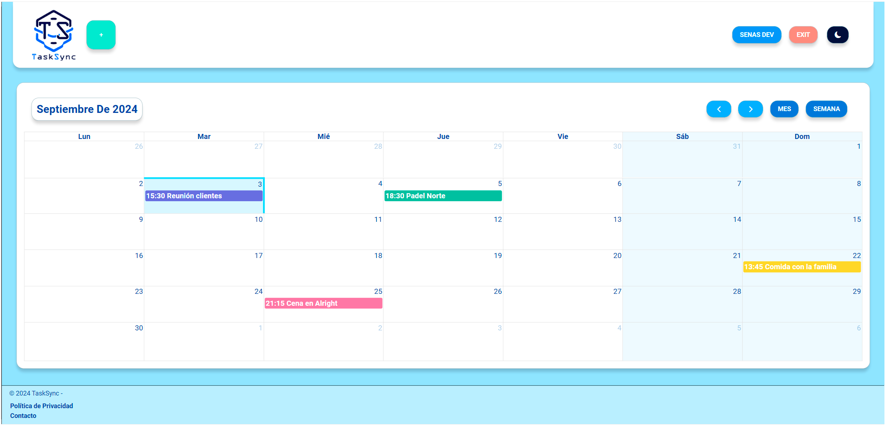
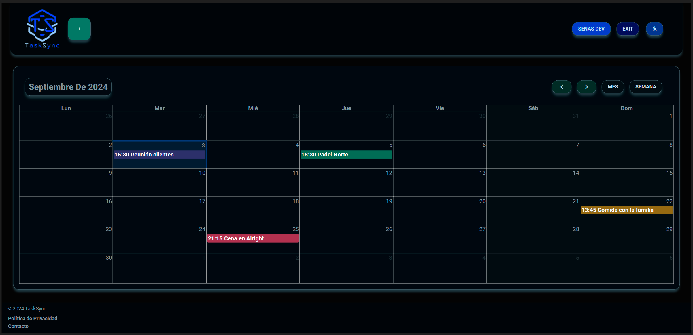

# 📅 TaskSync 

Bienvenido a **TaskSync**, una aplicación diseñada para ayudarte a organizar tus eventos y actividades diarias de manera eficiente. Con un enfoque simple y funcional, esta app te permite gestionar tus eventos de ocio, deporte, trabajo, y más. Además, puedes disfrutar de vistas semanales, mensuales y un modo noche para una experiencia más cómoda.
- 

## 🚀 Funcionalidades

### 1. Registro y Login
- Los usuarios pueden registrarse y acceder a la aplicación de manera segura.
- 

### 2. Registro y Modificación de Eventos
- Crea, edita y organiza eventos en diferentes categorías como ocio, deporte, trabajo y otros.
- 

### 3. Vista Semanal
-  Visualiza tus eventos organizados por semana para una planificación más precisa.
- 

### 4. Vista Mensual
- Navega a través de tus eventos en una vista mensual, ideal para tener una visión general.
- 

### 5. Modo Noche/Día
- Cambia entre modo noche y día para adaptar la visualización según la hora del día.
- 

### 6. Edición de Usuario y Contraseña
- Los usuarios pueden editar su perfil y cambiar su contraseña cuando lo deseen.

## 🛠️ Tecnologías Utilizadas

### Frontend

  
  
  

### Backend

  
  

